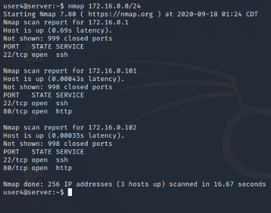
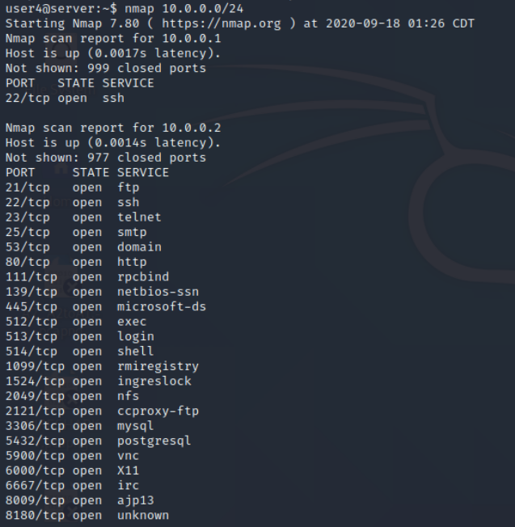
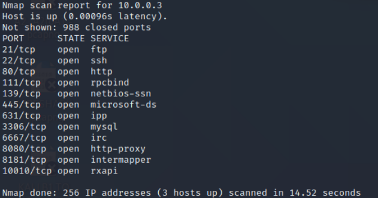
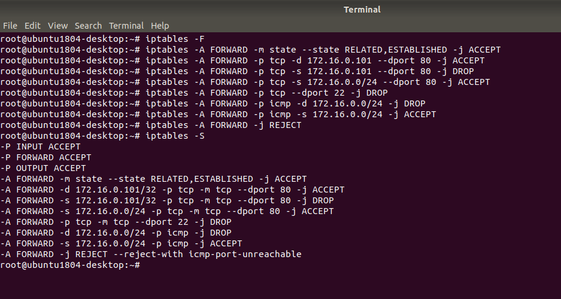

# Project1
Group work for Computer Systems Security, project 1.

## Introduction

## Network Diagnosis, Task II

### A) NMap commands to scan the computers and the service ports
### B) Discovered IP's and services in Network A and B
#### 1) Run NMap in A.2 on Network A

`nmap 172.16.0.0/24`

Scan all computers and services in Network A. Record the identified computers and services.

#### 2) Run NMap in A.2 on Network B

`nmap 10.0.0.0/24`

Scan all computers and services in Network B. Record the identified computers and services.

### C) Wireshark results of checking the web service between B.1 and A.1, and, A.2 and A.1
#### B.1 and A.1
#### A.2 and A.1

### D) Wireshark results of checking the ping between B.1 and A.1, and, A.2 and A.1
#### B.1 and A.1
#### A.2 and A.1

## Impliment Security Policy, Task III
### A) Access Control Matrix
### B) Issues with Policy Compliance 
### C) iptables Rules in R

## Test Implimentation of The Security Policy, Task IV
### A) Show NMap Results of Exposure of Network A
### B) Wireshark results of checking the web service between B.1 and A.1, and, A.2 and A.1
#### B.1 and A.1, stating whether or not web service is allowed between computers.
#### A.2 and A.1, stating whether or not web service is allowed between computers.
### C) Wireshark results of checking the ping between B.1 and A.1, and, A.2 and A.1
#### B.1 and A.1, stating whether or not ping is allowed between computers.
#### A.2 and A.1, stating whether or not ping is allowed between computers.

## Closing
### A) Show iptables rules to enforce the security policy in A.1
### B) Show iptables rules to enforce the security policy in A.2
### C) Discussion of how the security policy could ensure non-Disclosure
